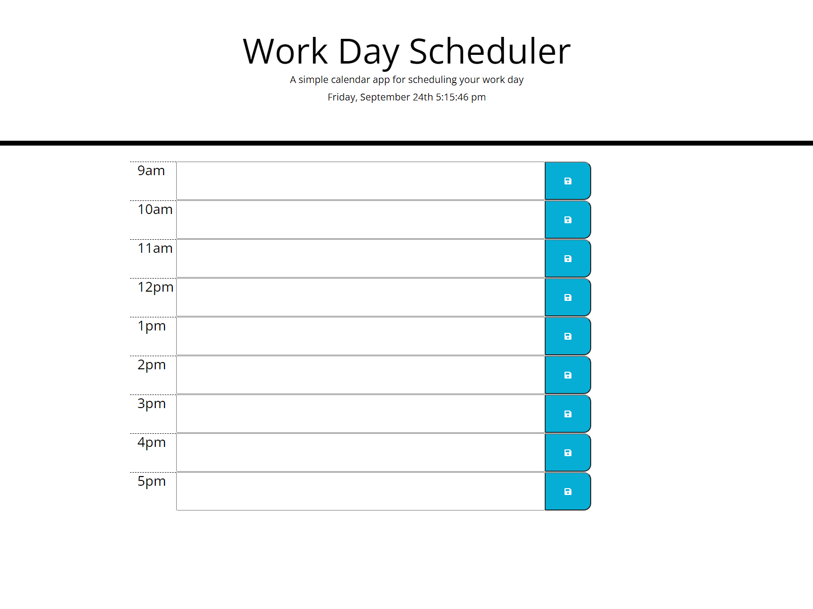
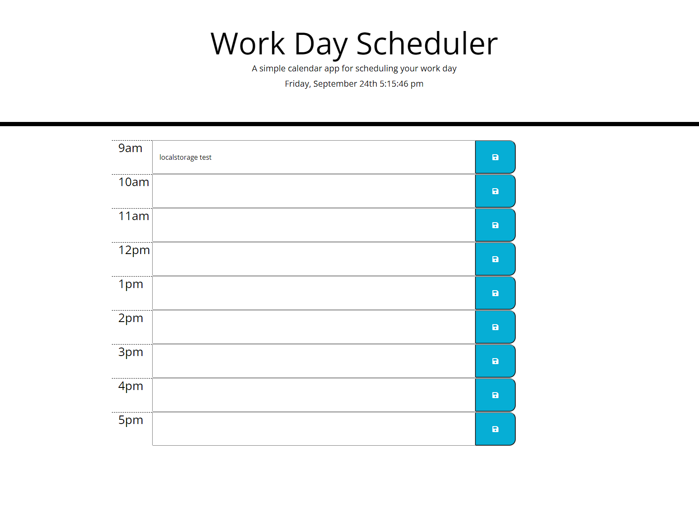
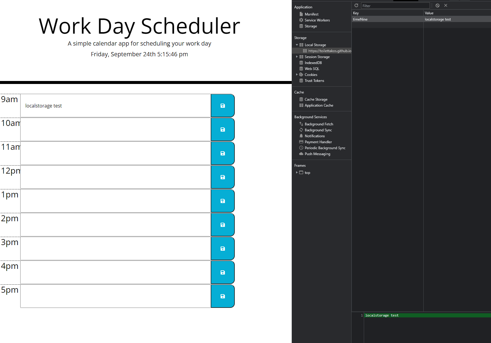
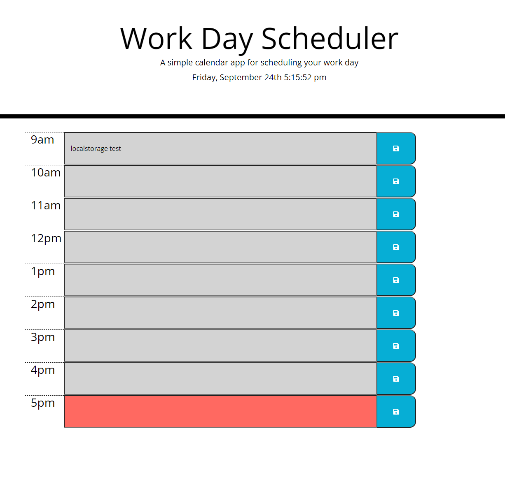

# Work Day Scheduler

Create a simple calendar application that allows the user to save events for each hour of the day.

## process

* wrote the HTML to display everything properly
* added js and jQuery to write out the functions to capture inputs
* wrote the localStorage functions to store the data 
* wrote the localStorage getitems functions to pull the data on page refresh
* used moments to put the time display in the header
* used moments to create if else if and else statment to determin time in each hour block to display colour based on past present or future
* detailed out the README

## Links
GitHub: https://github.com/ToiletTakos/work-day-schedule

Deployed app(pages): https://toilettakos.github.io/work-day-schedule/

## Screenshots

